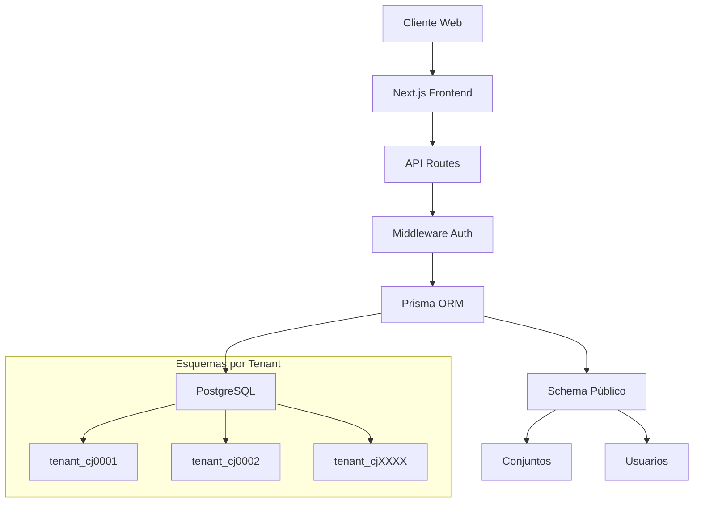

# 🏢 Armonía - Sistema de Administración de Conjuntos Residenciales

[](https://github.com/CIDESOLUTIONS/AppArmonia/actions/workflows/ci-cd.yml)
[](https://github.com/CIDESOLUTIONS/AppArmonia)
[](LICENSE)

**Armonía** es una plataforma integral SaaS multi-tenant para la gestión eficiente de conjuntos residenciales. Conecta administradores, residentes y personal en un ecosistema digital completo.

## ✨ Características Principales

### 🏠 **Gestión Integral**
- **Propiedades y Residentes**: Administración completa de unidades, propietarios y residentes
- **Vehículos y Mascotas**: Control de parqueaderos y registro de mascotas
- **Multi-tenant**: Cada conjunto tiene su propio esquema de base de datos aislado

### 💰 **Módulo Financiero**
- **Presupuestos**: Gestión anual con seguimiento en tiempo real
- **Cuotas**: Generación automática de cuotas ordinarias y extraordinarias
- **Pagos**: Seguimiento de cartera y estado de pagos por propiedad
- **Reportes**: Informes financieros detallados y exportables

### 🗳️ **Asambleas Digitales**
- **Convocatorias**: Invitaciones automáticas con orden del día
- **Votaciones**: Sistema de votación en tiempo real con múltiples opciones
- **Quórum**: Cálculo automático de asistencia y representación
- **Actas**: Generación digital de actas con firmas electrónicas

### 📋 **Sistema PQR**
- **Categorización**: Peticiones, Quejas, Reclamos y Sugerencias
- **Seguimiento**: Estados y tiempos de respuesta
- **Asignación**: Distribución automática por categorías
- **Indicadores**: Métricas de eficiencia y satisfacción

### 🏊 **Servicios Comunes**
- **Reservas**: Sistema de reservas con calendario integrado
- **Disponibilidad**: Control de horarios y capacidad
- **Estadísticas**: Uso de servicios y preferencias de residentes

### 📱 **Comunicación Integrada**
- **Citofonía Virtual**: Integración con WhatsApp/Telegram
- **Correspondencia**: Control de paquetes y correspondencia
- **Tablón Digital**: Anuncios y comunicados oficiales
- **Notificaciones**: Alertas en tiempo real

## 🚀 Stack Tecnológico

### Frontend
- **Next.js 15.3.3+** - Framework React con App Router
- **React 19.1+** - Biblioteca de interfaz de usuario
- **TypeScript** - Tipado estático para mayor robustez
- **Tailwind CSS** - Framework de utilidades CSS
- **Shadcn/UI** - Componentes accesibles y personalizables

### Backend
- **Next.js API Routes** - API serverless integrada
- **Prisma 6.5.0+** - ORM moderno con tipado TypeScript
- **PostgreSQL 17.5+** - Base de datos relacional robusta
- **JWT** - Autenticación stateless segura
- **bcrypt** - Hash seguro de contraseñas

### Herramientas
- **Zod** - Validación de datos con TypeScript
- **Recharts** - Gráficos y visualizaciones
- **React Hook Form** - Gestión eficiente de formularios
- **date-fns** - Manipulación de fechas

## 📦 Modelo de Negocio Freemium

### 🆓 **Plan Básico (Gratuito)**
- Hasta 25 unidades residenciales
- Gestión de propiedades y residentes
- Portal básico de comunicaciones
- 1 año de históricos

### 💎 **Plan Estándar ($25/mes)**
- Hasta 40 unidades (+$1/unidad adicional)
- Asambleas y votaciones completas
- Sistema PQR avanzado
- 3 años de históricos

### 👑 **Plan Premium ($50/mes)**
- Hasta 90 unidades (+$1/unidad adicional)
- Módulo financiero completo
- Personalización de marca
- API para integraciones
- 5 años de históricos
- Soporte 24/7

## 🏗️ Arquitectura Multi-tenant



## 🚦 Inicio Rápido

### Prerrequisitos
- Node.js 18+ 
- PostgreSQL 17.5+
- npm o yarn

### Instalación

1. **Clonar el repositorio**
```bash
git clone https://github.com/CIDESOLUTIONS/AppArmonia.git
cd AppArmonia
```

2. **Instalar dependencias**
```bash
npm install
```

3. **Configurar variables de entorno**
```bash
cp .env.example .env.local
# Editar .env.local con tus configuraciones
```

4. **Configurar base de datos**
```bash
# Generar cliente Prisma
npx prisma generate

# Ejecutar migraciones
npx prisma migrate dev

# Poblar con datos de prueba
npm run db:seed
```

5. **Iniciar servidor de desarrollo**
```bash
npm run dev
```

La aplicación estará disponible en `http://localhost:3000`

## 🧪 Credenciales de Prueba

### Administrador
- **Email**: `admin@villaarmonia.com`
- **Contraseña**: `123456`

### Residente  
- **Email**: `residente1@email.com`
- **Contraseña**: `123456`

### Recepción
- **Email**: `recepcion@villaarmonia.com`
- **Contraseña**: `123456`

## 📝 Scripts Disponibles

```bash
# Desarrollo
npm run dev          # Servidor de desarrollo
npm run build        # Compilar para producción
npm run start        # Servidor de producción
npm run lint         # Linting con ESLint
npm run type-check   # Verificación de tipos

# Base de datos
npm run db:generate  # Generar cliente Prisma
npm run db:push      # Sincronizar esquema
npm run db:migrate   # Ejecutar migraciones
npm run db:studio    # Abrir Prisma Studio
npm run db:seed      # Poblar con datos de prueba

# Pruebas
npm run test         # Ejecutar pruebas
npm run test:watch   # Modo watch para pruebas
npm run test:coverage # Cobertura de pruebas
```

## 🗂️ Estructura del Proyecto

```
armonia-app/
├── 📁 prisma/
│   ├── schema.prisma       # Esquema de base de datos
│   ├── migrations/         # Migraciones de Prisma
│   └── seed.ts            # Datos de prueba
├── 📁 src/
│   ├── 📁 app/
│   │   ├── 📁 (public)/   # Landing page
│   │   ├── 📁 (auth)/     # Autenticación
│   │   ├── 📁 (admin)/    # Panel administrador
│   │   ├── 📁 (resident)/ # Panel residente
│   │   ├── 📁 (reception)/ # Panel recepción
│   │   └── 📁 api/        # API Routes
│   ├── 📁 components/     # Componentes reutilizables
│   ├── 📁 lib/           # Utilidades y configuración
│   ├── 📁 hooks/         # Custom React hooks
│   └── 📁 types/         # Definiciones TypeScript
├── 📁 docs/              # Documentación
└── 📁 tests/             # Pruebas
```

## 🔒 Seguridad

- **Autenticación JWT** con tokens de acceso y refresh
- **Autorización por roles** granular
- **Validación de datos** con Zod en cliente y servidor  
- **Rate limiting** para prevenir ataques
- **Sanitización** de entradas de usuario
- **Headers de seguridad** configurados
- **Aislamiento multi-tenant** por esquemas

## 🚀 Roadmap

### Fase 1: MVP ✅
- [x] Landing page optimizada
- [x] Sistema de autenticación multi-rol
- [x] Dashboards básicos por rol
- [x] Arquitectura multi-tenant

### Fase 2: Operativa Básica (En desarrollo)
- [ ] Gestión completa de inventario
- [ ] Sistema PQR funcional
- [ ] Gestión básica de asambleas

### Fase 3: Versión Avanzada
- [ ] Módulo financiero completo
- [ ] Comunicaciones integradas
- [ ] Gestión de servicios comunes

### Fase 4: Profesionalización
- [ ] Panel de recepción/vigilancia
- [ ] API REST para integraciones
- [ ] Personalización visual
- [ ] Optimización y pruebas E2E

## 🤝 Contribución

1. Fork el proyecto
2. Crea una rama para tu feature (`git checkout -b feature/AmazingFeature`)
3. Commit tus cambios (`git commit -m 'Add some AmazingFeature'`)
4. Push a la rama (`git push origin feature/AmazingFeature`)
5. Abre un Pull Request

## 📄 Licencia

Este proyecto está bajo la Licencia MIT - ver el archivo [LICENSE](LICENSE) para detalles.

## 👥 Equipo

- **Desarrollador Principal**: MiniMax Agent
- **Arquitectura**: Sistema multi-tenant con Next.js 15 + React 19
- **Base de Datos**: PostgreSQL con Prisma ORM

## 📞 Soporte

- **Documentación**: [/docs](./docs/)
- **Issues**: [GitHub Issues](https://github.com/CIDESOLUTIONS/AppArmonia/issues)
- **Email**: soporte@armonia.com

---

⭐ Si este proyecto te resultó útil, ¡dale una estrella en GitHub!

🏢 **Armonía** - Transformando la gestión residencial con tecnología avanzada.
